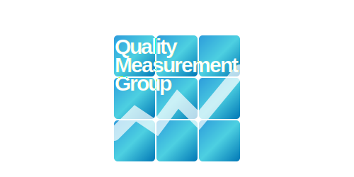

<table width="860" align="center">
  <tr>
    <td width="300" align="center" valign="top">
      <h3>Developers Connecting Systems</h3>
      

        
      

    </td>
    <td valign="top">
      
David Balkcom, MPH, Principal Solutions Architect and a senior Health IT developer at Quality Measurement Group.

      
As an engineer, David translates subject-matter expertise into domain-specific harnessing for digital-AI workers to deliver deterministic responses for clinical and business analytics.

      <ul>
        <li>Delivering data interoperability</li>
        <li>Implementing digital workers</li>
        <li>Tuning LLM inference models &amp; eval pipelines</li>
        <li>Leveraging graph to automate data-analytic procedures</li>
      </ul>
    </td>
  </tr>
</table>

  

<table width="860" align="center">
  <tr>
    <td width="300" align="center" valign="middle">
      

        
      

      

        <strong>SEMANTIC INTEROPERABILITY</strong> 
        clean signal from complex data
      

    </td>
    <td valign="middle">
      <h1 align="">Quality Measurement Group</h1>
      
Quality Measurement Group provides consulting & managed services as a vendor in the Health IT vertical. Their flagship offering is a clinical business AI software development kit & enterprise GenAI pedestal for digital workers.

      <ul>
        <li>Visual intelligence for complex workflow and quality signals</li>
        <li>Closed-loop quality improvement and management-system integration</li>
        <li>CAD and public health emergency mgmt common operating picture</li>
        <li>AI clinical systems architecture and bidirectional patient data exchange</li>
        <li>Non-conformance, process deviation, and anomaly detection</li>
        <li>Compliance-aware interoperability integration</li>
      </ul>
    </td>
  </tr>
</table>

  <strong>si-software-lab</strong> |
  <a href="mailto:helpdesk@qualitymeasurementgroup.com">helpdesk@qualitymeasurementgroup.com</a>

